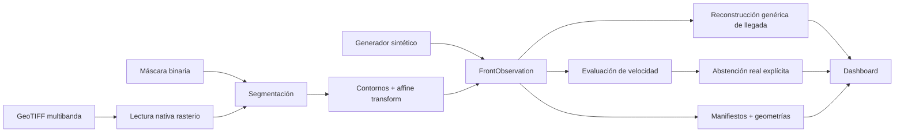

# Arquitectura del MVP

## Responsabilidades

| Módulo | Responsabilidad |
|---|---|
| `models.py` | Contratos inmutables con ground truth opcional y metadatos reales |
| `identity.py` | Identidad estable y SHA-256 adaptados de `DetectorDeIncendios` |
| `synthetic.py` | Observaciones sintéticas con verdad conocida |
| `ingestion/geotiff.py` | Lectura, QA, segmentación y extracción geoespacial |
| `reconstruction.py` | Llegada genérica, velocidad sintética y abstención real |
| `outputs.py` | Manifiestos, geometrías, tablas y dashboard |
| `cli.py` | Comandos `demo` e `ingest-geotiff` |

## Separación científica

- `observed`: geometría extraída de una observación o máscara.
- `ground_truth`: disponible únicamente en el escenario sintético.
- `inferred`: campo de llegada rasterizado entre observaciones.
- `forecast`: no implementado.

La reconstrucción de llegada acepta geometrías no radiales y múltiples
componentes. La velocidad sintética conserva el estimador radial original. Para
geometrías reales el sistema se abstiene explícitamente, porque aplicar ese
estimador produciría una afirmación no defendible.

## Sustitución por datos reales

El adaptador GeoTIFF produce `FrontObservation` sin depender del origen del
dataset. Para integrar FLAME 3, NASA AMS o una quema controlada se debe construir
un empaquetado que cumpla `GEOTIFF_INPUT_CONTRACT.md`; reconstrucción, salidas y
auditoría permanecen desacopladas del proveedor.

