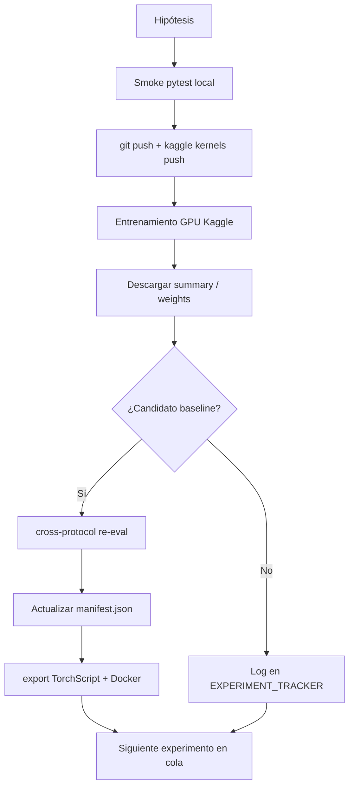

# Mega Estado del Proyecto — WildfireFrontDynamics

> **Fecha:** 2026-07-15  
> **Repo:** [AlonsoAlviraa/WildfireFrontDynamics](https://github.com/AlonsoAlviraa/WildfireFrontDynamics)  
> **Kaggle:** `alonsoalviraaaa`  
> **Último commit relevante:** `bc62c19` (fix preprocess `--output-root` para overnight mega)  
> **Documentos canónicos:** `EXPERIMENT_TRACKER.md`, `PRODUCTION_READINESS_AUDIT.md`, `LOOP_ENGINEERING_PLAN.md`

---

## 1. Resumen ejecutivo

WildfireFrontDynamics es un proyecto de investigación con **dos pistas paralelas**:

| Pista | Objetivo | Estado |
|-------|----------|--------|
| **GeoTIFF / MVP** | Reconstruir dinámica de frente desde secuencias térmicas LWIR | Pipeline sintético + demo; **no operacional** para incendios reales |
| **NDWS / ML spread** | Predecir propagación día+1 en parches 64×64 (Google NDWS) | **v21 en producción** para inferencia de parches; loop activo en Kaggle |

**Veredicto honesto:** El modelo v21 es el primero que **supera el baseline naive copy** en el grid completo bajo protocolo honesto (IoU 0.226, Δ +0.076). El repo tiene stack de inferencia (TorchScript, Docker, CLI) pero **no debe presentarse como servicio operacional de incendios reales** hasta validación CLM/Tobarra y checklist de despliegue completo.

**En curso ahora:** Mega entrenamiento nocturno v2 (`v23`–`v30`) en Kaggle — **RUNNING** tras corregir bug de rutas de preprocesado.

---

## 2. Modelo de producción actual — v21

### Configuración

| Parámetro | Valor |
|-----------|-------|
| Arquitectura | `ResidualWildfireUNetSmall` |
| Target mode | `delta` (predice crecimiento; en eval suma `prev_fire`) |
| Loss | Composite (BCE pos_weight=5 + Dice 0.3 + Tversky 0.3) |
| Optimizer | AdamW lr=1e-3, warmup 3 + cosine |
| Early-stop | `improvement_vs_copy_iou` (grid completo) |
| Filter entrenamiento | `any_fire` |
| Patch | 64×64, 1 timestep, 17 canales + prev_fire → 18 in_channels |
| Kernel origen | `alonsoalviraaaa/wildfire-front-training-v21` |

### Métricas test (protocolo honesto, 979 patches)

| Métrica | Valor | Interpretación |
|---------|-------|----------------|
| **IoU @0.5 (full)** | **0.226** | Rendimiento principal |
| Copy baseline IoU | 0.150 | Naive: predice `prev_fire` en todo el grid |
| **Δ vs copy (full)** | **+0.076** | Criterio P0 de producción — **superado** |
| Δ vs dilated copy (changed) | +0.041 | Mejora en píxeles que cambian |
| Legacy Δ naive changed | +0.214 | Solo auditoría; métrica inflada pre-fix |
| best_epoch | 6 | Early-stop temprano |

### Artefactos

```
models/production/
├── manifest.json           # contrato de versión y métricas
├── weights_v21_best.pt       # pesos PyTorch (gitignored en repo limpio)
├── spread_model_v21.pt       # TorchScript exportado
└── spread_model_v21.json     # metadata del export
```

### Stack de inferencia

| Componente | Ruta |
|------------|------|
| Clase inferencia | `wildfire_front/ml/spread_predictor.py` |
| CLI predict | `scripts/predict_spread.py` |
| Export TorchScript | `scripts/export_production_model.py` |
| Instalar pesos | `scripts/install_production_weights.py` |
| Loop producción | `scripts/run_production_loop.py` |
| Docker | `Dockerfile` target `inference` (CPU torch) |

### Criterio auto-promoción (monitor overnight)

Un candidato reemplaza v21 si:

- `test_iou > 0.2256`, **o**
- `test_iou ≈ 0.226` **y** `improvement_vs_copy_iou > 0.0756`

Script: `scripts/run_overnight_monitor.py`

---

## 3. Historial de experimentos y resultados

### Tabla comparativa (protocolo alineado, test 979 patches `any_fire`)

| Ver | Fecha | Cambio principal | IoU full | Δ vs copy | Δ changed (dilatado) | Veredicto |
|-----|-------|------------------|----------|-----------|----------------------|-----------|
| v10–v12 | 2026-07 | Iteraciones tempranas | ~0.002 | negativo | — | Fallidos |
| **v14** | 2026-07-10 | U-Net Small + composite loss | 0.227* | +0.077 | +0.098* | Referencia fuerte, superseded |
| v19 | 2026-07-13 | `changed_weighted` target | 0.052 | -0.098 | +0.71† | Diagnóstico; métrica tautológica |
| v20 | 2026-07-13 | Residual + changed_weighted | 0.050 | -0.100 | — | Fallido; precision ~5% |
| **v21** | 2026-07-14 | `target_mode=delta` | **0.226** | **+0.076** | +0.041 | **PRODUCCIÓN** |
| v22 | 2026-07-14 | `--filter-mode changed` | 0.225 | +0.075 | **+0.081** | Neutral full; mejor en changed |

\* v14: 0.239 en test original 619 patches; cross-protocol 979 → 0.227.  
† v19: el +0.71 en changed era artefacto (copy_changed = 0 siempre).

### v14 — baseline histórico

- Primer salto cuantitativo masivo vs v10–v12 (IoU ×125).
- Arquitectura `WildfireUNetSmall` estándar, `target_mode=absolute`.
- Sigue siendo competitivo en cross-protocol (0.227 ≈ v21).
- **Limitación:** entrenado/evaluado inicialmente en split distinto (619 vs 979 test).

### v19/v20 — línea muerta

| Problema | Evidencia |
|----------|-----------|
| `changed_weighted` sin delta | IoU full ~0.05, peor que copy |
| Residual sin delta | v20 no recupera IoU |
| Over-predicción | Precision ~5% en v20 |
| Métrica Tier-1 engañosa | `copy_baseline_iou_changed` = 0.0 siempre → Δ inflated +0.87 |

**Conclusión:** No reintentar changed_weighted ni residual sin delta como única variable.

### v21 — breakthrough real

- **Una sola variable** vs v20: `--target-mode delta`.
- Primer modelo con Δ vs copy **positivo y estable** en grid completo.
- Early-stop en métrica honesta evita sobreajuste a parches densos.
- Promovido a `models/production/manifest.json`.

### v22 — filtro changed-only

| Métrica | v21 | v22 | Δ |
|---------|-----|-----|---|
| IoU full | 0.226 | 0.225 | -0.001 |
| Δ vs copy full | +0.076 | +0.075 | -0.001 |
| Δ vs dilated changed | +0.041 | +0.081 | **+0.040** |
| Val peak IoU | — | 0.255 (ep 38) | No transfiere a test |

**Veredicto:** Mantener v21 en producción. v22 informa que entrenar solo en parches *changed* mejora la métrica en píxeles que cambian, pero no el IoU full en test.

---

## 4. Crisis de métricas (corregida)

### El bug

En parches donde `prev ≠ target`, el copy naive predice `prev` → IoU changed del copy = **0.0 siempre**.

La métrica antigua `improvement_vs_copy_iou_changed` restaba 0, así que **cualquier modelo con IoU changed > 0 mostraba +0.87 “Tier-1 breakthrough”** sin significado.

### La corrección (`wildfire_front/ml/ndws_metrics.py`)

| Métrica nueva | Baseline | Uso |
|---------------|----------|-----|
| `improvement_vs_copy_iou` | Copy naive (full grid) | **Primaria** — early-stop, promoción |
| `improvement_vs_copy_iou_changed` | Copy **dilatado** en changed pixels | Secundaria — calidad en frente |
| `legacy_improvement_vs_naive_copy_iou_changed` | Copy naive changed (=0) | Solo auditoría histórica |

### Impacto

- v19/v20 dejan de parecer “breakthroughs” en changed.
- v14 re-evaluado en cross-protocol: sigue fuerte (+0.098 Δ changed vs dilated).
- Todas las comparaciones futuras deben citar **protocolo** (`any_fire`, N patches, baseline).

### Cross-protocol re-eval

**Kernel:** `alonsoalviraaaa/wildfire-cross-protocol-reeval`  
**Commit fix:** `0944576`

Alineó v14, v19, v20 (y posteriores) en el **mismo test de 979 patches** con el mismo preprocessor v2. Sin esto, comparar v14 (0.239) con v19 (0.052) era manzanas vs peras.

---

## 5. Datos y preprocesado

### Fuente principal

- **Dataset Kaggle:** `fantineh/next-day-wildfire-spread` (NDWS TFRecords)
- **CLM patches:** `alonsoalviraaaa/clm-wildfire-patches` (incendios reales España)
- **Pesos checkpoint:** `alonsoalviraaaa/wildfire-checkpoint-weights` (v14, v19, v20, v21)

### Preprocessor v2 (`kaggle_job/preprocess_ndws.py`)

| Mejora vs v1 | Detalle |
|--------------|---------|
| Grid 64×64 completo | Sin sub-patch que descarta 75% resolución |
| 1 timestep real | No replica el mismo frame 3× |
| Split leak-free | Shards TFRecord disjuntos train/val/test |
| Filtros | `any_fire`, `changed`, `both_fire`, `none` |
| `--output-root` | **Nuevo** — permite múltiples roots (`/tmp/ndws_npz_any_fire`, etc.) |

### Protocolos de filtro

| Modo | Criterio | Copy IoU típico | Uso |
|------|----------|-----------------|-----|
| `any_fire` | prev>0 OR fire>0 | ~0.150 | **Test estándar**, v21 |
| `changed` | al menos 1 píxel difiere | — | v22, overnight v24–v29 |
| `both_fire` | prev>0 AND fire>0 | ~0.788 | Análisis leakage (sesgado) |

**Regla:** Siempre etiquetar protocolo al citar copy IoU (0.150 vs 0.788 no es bug).

---

## 6. Mega entrenamiento nocturno (v23–v30)

### Objetivo

8 experimentos secuenciales en **una sesión T4** (~2–4 h), reutilizando preprocess por `filter_mode`.

**Kernel:** `alonsoalviraaaa/wildfire-overnight-mega-training`  
**Script:** `kaggle_job/run_overnight_mega.py`

### Cola de experimentos

| Ver | Hipótesis | data_key | Variables clave |
|-----|-----------|----------|-----------------|
| v23 | v21 + EMA 0.999 | any_fire | ema_decay=0.999 |
| v25 | v21 schedule largo | any_fire | 100 epochs, patience 20 |
| v27 | v21 + focal loss | any_fire | loss=focal |
| v28 | v21 LR fino | any_fire | lr=5e-4, 80 epochs |
| v24 | v22 changed + EMA | changed | ema_decay=0.999 |
| v26 | v22 changed largo | changed | 100 epochs |
| v29 | v22 changed + focal | changed | loss=focal |
| v30 | CLM fine-tune | any_fire | warm_start v21, lr=3e-4, 35 ep |

### Run 1 — ERROR (2026-07-14/15)

```
RuntimeError: Insufficient data after preprocessing: 0 patches (expected >= 50)
```

**Causa:** `run_overnight_mega.py` esperaba NPZ en `/tmp/ndws_npz_any_fire/`, pero `preprocess_ndws.py` escribía siempre en `/tmp/ndws_npz/` (hardcoded). Preprocess corrió ~3.5 min, generó datos en ruta incorrecta, contador leyó 0.

**Resultado:** 0/8 experimentos entrenados. Sin `overnight_report.json`.

### Run 2 — FIX + relanzado (2026-07-15)

**Fix:** `--output-root` en `preprocess_ndws.py` + paso desde `kaggle_common.run_preprocess_ndws()`  
**Commit:** `bc62c19`  
**Estado al redactar este doc:** `KernelWorkerStatus.RUNNING`  
**Monitor:** `scripts/run_overnight_monitor.py` (poll 300s)

### Output esperado

```
/kaggle/working/
├── overnight_report.json      # incremental + final
└── experiments/
    ├── v23/weights_pretrained_best.pt
    ├── v25/...
    └── ...
```

Descarga local: `kaggle kernels output alonsoalviraaaa/wildfire-overnight-mega-training -p kaggle_outputs_overnight`

---

## 7. Infraestructura Kaggle y MCP

### Patrón actual (v22+)

```
1. Clone repo → /tmp/WildfireFrontDynamics (NO /kaggle/working)
2. preprocess_ndws → /tmp/ndws_npz[_suffix]/
3. merge CLM patches (opcional)
4. run_training → /kaggle/working/experiments/{version}/
5. Solo artefactos en output del kernel
```

### Kernels relevantes

| Slug | Estado | Notas |
|------|--------|-------|
| `wildfire-front-training-v21` | COMPLETE | Producción |
| `wildfire-front-training-v22` | COMPLETE | Changed filter |
| `wildfire-cross-protocol-reeval` | COMPLETE | Alineación métricas |
| `wildfire-overnight-mega-training` | RUNNING (v2) | v23–v30 |

### MCP (`.vscode/mcp.json`)

| Server | Uso |
|--------|-----|
| GitHub HTTP | CI, PRs, issues |
| Kaggle stdio (`uvx kaggle-mcp-server`) | Status kernels, datasets |

**Nota:** MCP es ortogonal a calidad del modelo; complementa monitoreo.

### Deuda infra

| Problema | Estado |
|----------|--------|
| Scripts v14–v21 duplican ~200 líneas | v22+ usa `kaggle_common.py`; legacy sin refactor |
| v19–v21 clonaban en `/kaggle/working` | Bloat ~300 MB en outputs; no retrofitted |
| `kernel-metadata.json` local sobrescrito al push overnight | Manual restore a v22 metadata si se lanza otro kernel |
| Monitor overnight puede no persistir si terminal cierra | Relanzar `python scripts/run_overnight_monitor.py 300` |

---

## 8. Problemas abiertos y riesgos

### Críticos (bloquean “operacional real”)

| # | Problema | Impacto | Mitigación actual |
|---|----------|---------|-------------------|
| 1 | Sin validación incendios reales (CLM/Tobarra) | No sabemos transferencia NDWS→España | v30 fine-tune CLM en overnight; eval pendiente |
| 2 | Pesos no en git (`*.pt` gitignored) | Clone fresco sin modelo | manifest + Kaggle dataset + install script |
| 3 | Dos tracks confusos (A3C GeoTIFF vs U-Net NDWS) | Evaluación equivocada | `evaluate_current_model.py` es legacy A3C |
| 4 | Docker no validado localmente | Deploy incierto | Docker Desktop no estaba activo en última prueba |

### Importantes (investigación / calidad)

| # | Problema | Detalle |
|---|----------|---------|
| 5 | Doble residual (arch + delta target) | Redundante; funcionó en v21 pero vigilar inestabilidad |
| 6 | v22 val>>test (0.255 vs 0.225) | Posible overfit en changed-filter |
| 7 | Documentación parcialmente stale | `PRODUCTION_READINESS_AUDIT.md` dice v22 RUNNING; `LOOP_ENGINEERING_PLAN.md` idem |
| 8 | IoU ~0.22–0.23 es modesto | Supera copy pero lejos de “forecasting útil” sin más features/temporal |
| 9 | Repo local con ruido | `WildfireFrontDynamics/` anidado, `ci_logs.zip`, bundles sin commit |

### Resueltos recientemente

| Problema | Fix | Commit |
|----------|-----|--------|
| Métricas tautológicas Tier-1 | `ndws_metrics.py` v2 | `0944576` |
| Comparaciones cross-version inválidas | cross-protocol re-eval | `00a80e6` |
| Sin stack producción | spread_predictor + TorchScript + Docker | `07e02fc` |
| Overnight 0 patches | `--output-root` | `bc62c19` |
| Sin warm-start | `init_weights_path` en trainer | `4e76b9f` |

---

## 9. Hipótesis: qué funciona y qué no

### ✅ Aceptadas (evidencia)

| Hipótesis | Evidencia |
|-----------|-----------|
| Delta target + residual supera copy (full) | v21 Δ +0.076 |
| U-Net Small + composite loss es baseline sólido | v14 cross 0.227 |
| Cross-protocol obligatorio antes de promover | v14≈v21 solo alineados |
| Baseline dilatado para changed pixels | fix métricas |
| Changed-filter mejora Δ changed | v22 +0.081 vs v21 +0.041 |
| Clone /tmp evita bloat Kaggle | v22 outputs limpios |

### ❌ Rechazadas (no reintentar igual)

| Hipótesis | Evidencia |
|-----------|-----------|
| changed_weighted solo arregla IoU full | v19/v20 ~0.05 |
| residual sin delta | v20 fallido |
| Tier-1 +0.87 = breakthrough | artefacto métrico |
| Entrenar sin verificar output-root | overnight v1 ERROR |

### 🔄 En prueba (overnight v2)

| Hipótesis | Versión |
|-----------|---------|
| EMA estabiliza y mejora test | v23, v24 |
| Más epochs supera early-stop temprano (ep 6) | v25, v26 |
| Focal loss en ejemplos difíciles | v27, v29 |
| LR bajo fine-grain | v28 |
| CLM warm-start desde v21 | v30 |

---

## 10. Arquitectura del loop de experimentación



### Criterios de aceptación (LOOP_ENGINEERING_PLAN)

| Tier | Métrica | Target | v21 |
|------|---------|--------|-----|
| P0 | IoU full @0.5 | > 0.15 | ✅ 0.226 |
| P0 | Δ vs copy (full) | > 0 | ✅ +0.076 |
| P1 | Δ vs dilated (changed) | > 0 | ✅ +0.041 |
| P2 | Real-fire eval | TBD | ❌ pendiente |

---

## 11. Mapa de archivos canónicos

### Producción e inferencia

| Propósito | Ruta |
|-----------|------|
| Trainer | `wildfire_front/ml/unet_train.py` |
| Métricas | `wildfire_front/ml/ndws_metrics.py` |
| Inferencia | `wildfire_front/ml/spread_predictor.py` |
| Cross-eval | `wildfire_front/ml/cross_protocol_eval.py` |
| Export TS | `wildfire_front/ml/export_torchscript.py` |
| Manifest | `models/production/manifest.json` |

### Kaggle

| Propósito | Ruta |
|-----------|------|
| Preprocess | `kaggle_job/preprocess_ndws.py` |
| Helpers compartidos | `kaggle_job/kaggle_common.py` |
| Overnight mega | `kaggle_job/run_overnight_mega.py` |
| Metadata overnight | `kaggle_job/kernel-metadata-overnight-mega.json` |

### Operaciones

| Propósito | Ruta |
|-----------|------|
| Cola experimentos | `scripts/experiment_queue.json` |
| Monitor overnight | `scripts/run_overnight_monitor.py` |
| Loop producción | `scripts/run_production_loop.py` |
| Predict CLI | `scripts/predict_spread.py` |

### Documentación

| Doc | Contenido |
|-----|-----------|
| `EXPERIMENT_TRACKER.md` | Log vivo post-kernel |
| `PRODUCTION_READINESS_AUDIT.md` | Checklist deploy |
| `LOOP_ENGINEERING_PLAN.md` | Criterios y cola |
| **`MEGA_ESTADO_PROYECTO.md`** | **Este documento — snapshot global** |

---

## 12. Checklist de despliegue

| Item | Estado |
|------|--------|
| Manifest con versión, arquitectura, métricas | ✅ |
| SpreadPredictor + delta decode | ✅ |
| CLI predict | ✅ |
| Install script pesos | ✅ |
| TorchScript export | ✅ |
| Docker inference target | ✅ (sin validar local) |
| Production loop | ✅ |
| Real-fire validation CLM/Tobarra | ❌ |
| Meta-labeler en predicciones producción | ❌ |
| Monitoring drift precision/recall vs copy | ❌ |
| CI verde | ✅ pytest + ruff + mypy |

---

## 13. Próximos pasos recomendados

### Inmediato (cuando overnight v2 termine)

1. Descargar `overnight_report.json` y pesos por versión.
2. Identificar mejor candidato vs v21 (IoU full **y** Δ changed si aplica).
3. Si promoción: cross-protocol re-eval obligatorio antes de manifest.
4. Actualizar `EXPERIMENT_TRACKER.md`, `experiment_queue.json`, manifest.

### Corto plazo

1. Sincronizar docs stale (`PRODUCTION_READINESS_AUDIT`, `LOOP_ENGINEERING_PLAN`).
2. Evaluar v22/v24–v29 en protocolo dual: full + changed.
3. Subir pesos v22 al dataset Kaggle (`wildfire-checkpoint-weights`).
4. Validar Docker inference con Desktop activo.

### Medio plazo

1. Evaluación real-fuego (CLM patches holdout).
2. Refactor scripts v14–v21 → `kaggle_common.py`.
3. Esquema 12-canal NDWS (v23 en plan original de LOOP).
4. Separar claramente docs A3C/GeoTIFF vs NDWS/U-Net.

---

## 14. Glosario rápido

| Término | Significado |
|---------|-------------|
| **NDWS** | Next Day Wildfire Spread — dataset Google |
| **Copy baseline** | Predicción = máscara fuego día anterior |
| **Delta target** | Modelo predice `target - prev` (crecimiento) |
| **any_fire** | Filtro: parches con fuego en prev o target |
| **changed** | Filtro: al menos un píxel cambia entre prev y target |
| **Cross-protocol** | Re-evaluar todos los modelos en mismo test NPZ |
| **Residual U-Net** | Skip conexión ancla salida a `prev_fire` |

---

## 15. Veredicto final

| Pregunta | Respuesta |
|----------|-----------|
| ¿Hay modelo en producción? | **Sí — v21** |
| ¿Supera baseline copy? | **Sí — Δ +0.076** en 979 patches |
| ¿Es SOTA o operacional para incendios reales? | **No** — IoU ~0.22, sin validación real-fire |
| ¿Las métricas son honestas ahora? | **Sí** — post-fix `ndws_metrics.py` |
| ¿El overnight está corriendo? | **Sí — v2 RUNNING** tras fix output-root |
| ¿Qué fue lo peor que pasó? | v19/v20 parecían funcionar por métrica rota; overnight v1 perdió ~4h por bug rutas |

**En una frase:** WildfireFrontDynamics tiene un pipeline de investigación maduro, un modelo v21 que genuinamente aprende más que copy en NDWS, y una cola activa de 8 experimentos buscando ganancias incrementales — pero aún es investigación, no producto de emergencias.

---

*Generado para consolidar estado tras sesión loop-engineering 2026-07-14/15. Actualizar cuando overnight v2 complete.*