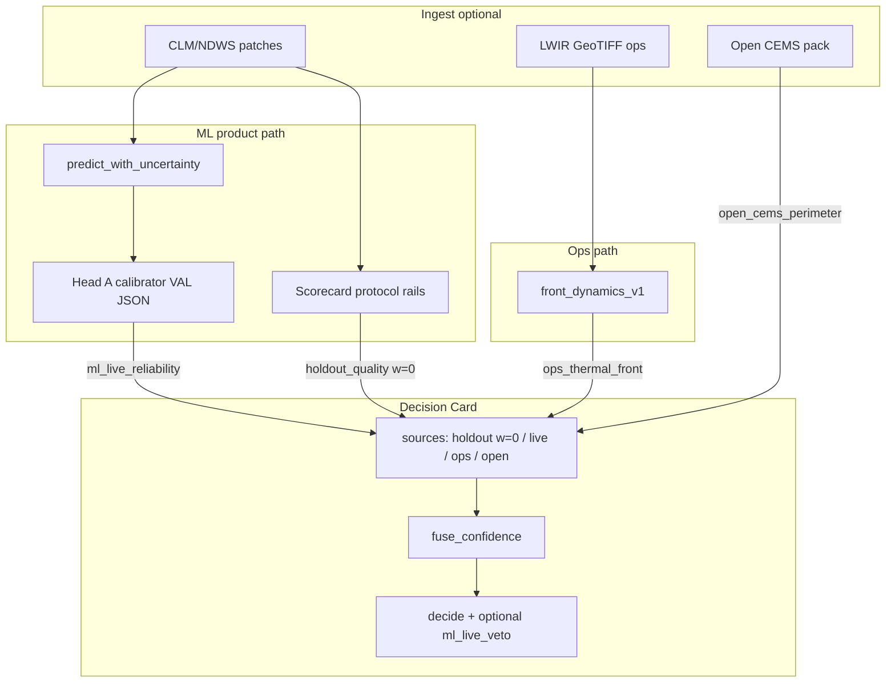

# Design — ML-First Product Focus (v1)

| Field | Value |
|-------|--------|
| **Status** | IMPLEMENTED core (PR1–PR5 code path) — rev 3 design; fusion remains off until U1 |
| **Author** | Systems architecture (loop-engineering) |
| **Date** | 2026-07-23 |
| **Revision** | 3 |
| **Canonical path** | `docs/design/ML_FOCUS_PRODUCT_V1.md` |
| **Related** | `ARCHITECTURE.md`, `docs/PRODUCTO_DUAL.md`, `RULES.md`, `MEMORY.md`, `docs/ML_TRANSFER_PROTOCOL.md`, `docs/design/DECISION_POLICY.md` |
| **Default ML product** | `clm_ensemble_v34` |
| **Ops product** | `front_dynamics_v1` |

---

## Overview

This design recenters engineering priority on the **ML product** as the innovation core of WildfireFrontDynamics. Open industrial packs, progressive burn simulation, and multi-CCAA sales plumbing are **integration already** — not the differentiator. Differentiation is proven only when:

1. A next-day (short-horizon) burned/spread mask **beats honest baselines** under a leak-free protocol, and  
2. The model emits **calibrated, abstention-capable uncertainty** that the Decision Card can use **honestly** — under rules that do **not** invent tactical ROS, mix drone metrics with IoU, or overclaim multi-source veto power.

**Innovation thesis (product claim — precise):**  
> ML innovation here is not “another fire mask U-Net.” It is **next-day mask prediction with protocol-clean evaluation and patch-level reliability that (a) drives ML-only / research Card paths to HOLD or ABSTAIN when unreliable, and (b) optionally influences multi-source fusion under caps without pretending ML vetoes thermal ops GO.**

**How ML “changes the Card” (no overclaim):**

| Context | Mechanism (normative) |
|---------|------------------------|
| **ML-only** (`research_open` / `default` with `allow_ml_only_hold`) | Live patch confidence is the **action signal** for HOLD vs ABSTAIN (not holdout IoU). Unreliable → ABSTAIN. |
| **Multi-source field** (`field_ops` + ops present) | **Default: no hard veto.** Ops remains the GO anchor. Live ML with `abstain=true` contributes **weight 0** + audit reason only — does **not** cancel an ops-backed GO. Optional policy flag `ml_live_veto_on_abstain` may force **HOLD** (never invent ROS; never alone unlock GO). |
| **Research display** | Catalog holdout IoU stays `weight=0` / `role=holdout_quality` forever. |

---

## Background & Motivation

### What already exists (do not rebuild)

| Layer | Reality in repo | Entry points |
|-------|-----------------|--------------|
| Dual product surface | Ops geometry ≠ ML masks; fuse only at Decision Card | `ARCHITECTURE.md`, `docs/PRODUCTO_DUAL.md` |
| Product catalog | `ndws_v21`, `clm_v28`, `clm_ensemble_v34` (+ alias v30) | `models/catalog.json`, `wildfire_front/ml/product_catalog.py` |
| Ensemble champion | Soft-vote + per-member temps VAL-only | `models/clm_ensemble/manifest.json` |
| Eval | CLM holdout, copy baselines, growth IoU | `wildfire_front/ml/clm_eval.py`, `ndws_metrics.py` |
| Decision Card | GO/HOLD/ABSTAIN + R1–R4 reliability (system, not fire) | `wildfire_front/product/confidence.py`, `decide_service.py` |
| Meta-labeler | RF safety filter + entropy features | `wildfire_front/ml/meta_labeler.py` (**not on product path**) |
| Physics loss | Rothermel / FFMC penalties | `wildfire_front/ml/physics.py` (feature rail G1 closed/killed) |
| Offline CI marker | `requires_weights` | `pyproject.toml`, `tests/test_*`, `CONTRIBUTING.md` |
| Holdout sizes | train **300** / val **390** / test **200** NPZ | `artifacts/clm_ndws_patches/holdout_v1/` |

### Published ML metrics (honest — do not invent)

| Product | Domain | IoU | Δ vs copy | Role |
|---------|--------|-----|-----------|------|
| `ndws_v21` | NDWS test | **0.226** (manifest 0.2256) | **+0.076** (0.0756) | Research baseline only |
| `clm_v28` | CLM holdout | **0.838** (0.8382) | **+0.196** (0.1964) | Single specialist |
| `clm_ensemble_v34` | CLM holdout ensemble | **0.8963** | **+0.2545** | **Emergency ML default** (growth IoU 0.9071) |

Source of truth: `models/*/manifest.json` + `ARCHITECTURE.md` / `MEMORY.md`.  
Weights (`models/**/*.pt`) are **gitignored**; CI without weights cannot assert real product paths.

### Critical product gaps (why ML-first now)

1. **ML does not enter live Decision confidence.**  
   `score_ml_source()` in `wildfire_front/product/confidence.py` scores holdout IoU as **research metadata** with **`weight: 0.0`**. Fusion explicitly skips `role=holdout_quality`. Flag `--use-ml-v34` only loads static catalog metrics via `load_ml_metrics_v34()` — never a live patch reliability signal.

2. **Ensemble has temperatures but no productized uncertainty surface.**  
   `EnsembleSpreadPredictor.predict()` soft-votes growth probs (`spread_predictor.py`) and applies `member_temperatures` from the manifest, but does **not** return member disagreement, predictive entropy maps, or a scalar “trust this mask” score for the Decision Card. Temperature is applied **once** at logits/T — any new API must not double-scale.

3. **Meta-labeler is stranded (and incomplete for field Card-only paths).**  
   `WildfireMetaLabeler` builds features `[prob, entropy, slope, aspect, wind, humidity, temp]` and can veto unreliable predictions, with allowlisted joblib loads under `models/`. Tests exist; product path does not. Full RF needs terrain/meteo maps (legacy17 channels) — **not** available from mask-only Decision JSON. No shipped VAL-fit RF artifact is part of v34. Default uncertainty path must work with **entropy + disagreement only**.

4. **No reliability/calibration product metrics.**  
   Scorecards track IoU / Δ copy / growth. There is **no** patch-level ECE of Card confidence, pixel ECE of fire probs, or selective-prediction curve in the product surface.

5. **Protocol integrity is documented, not fully code-enforced.**  
   `score_mix_from_cache` / `sweep_mix_threshold_from_cache` have **no split argument** — any cache can be scored. VAL-only mix is process culture (`leakage_policy`, loop scripts), not a library guard. High-risk callers: `scripts/run_ml_loop_3way.py` and ad-hoc sweeps.

6. **Loop attention dilution.**  
   Multi-CCAA packs, progressive burn, and open CEMS intake are Card **sources**, not ML differentiation.

### Hard product rules (must preserve)

| Rule | Enforcement surface today |
|------|---------------------------|
| Never mix drone ROS claims with ML IoU | `RULES.md`, dual product docs, scorecard separation |
| Fuse only at Decision Card; never train on fused labels | `ARCHITECTURE.md` diagram |
| Ops product `front_dynamics_v1` | `models/catalog.json` → `ops_product` |
| Default ML `clm_ensemble_v34` | catalog `default_product` / `emergency_ml_product` |
| Ensemble mix/temps on **VAL only** | Manifest notes + human process → **code rails this design** |
| Decide path GO/HOLD/**ABSTAIN**; no invented tactical Vp | `confidence.decide()`, policies in `config/decision_policies.json` |
| Weights gitignored | `models/*.pt` |

---

## Goals & Non-Goals

### Goals

| ID | Goal | Success signal |
|----|------|----------------|
| G1 | **Prove ML delta** vs copy / single specialist / open-only heuristics | Scorecard with locked protocol tags; champion ≥ floors |
| G2 | **Uncertainty-first ML** | Patch reliability + abstain path; ML-only Card reacts honestly |
| G3 | **Protocol integrity in code + CI** | Mix-search APIs require `split_role`; CI without weights |
| G4 | **Decision integration** | Live ML reliability (not holdout IoU) on Card under precise rules (§3.3) |
| G5 | **Evaluation productization** | Reproducible scorecard: IoU, Δ, patch ECE, selective@80%, fail cases |
| G6 | **Offline-first CI** | Default `pytest` green without `*.pt`; `@requires_weights` optional |
| G7 | **ML product GO gates** | Explicit GO vs research-only (M0–M9) |

### Non-goals

| Non-goal | Rationale |
|----------|-----------|
| Another CCAA open pack / multi-region sales pack | Integration exists; not ML differentiation |
| Progressive burn (PSB) as truth for training | Synthetic stages ≠ next-day holdout truth |
| Tactical dispatch ROS / Vp from ML masks | Ops ROS stays `front_dynamics_v1` only |
| Claiming commodity U-Net SOTA without protocol | Honesty > vanity IoU |
| Training on fused Decision Card labels | Leakage of policy into model |
| Reopening A3C / mega training as product path | Legacy under `models/model.py`, `kaggle_job/archive/` |
| Forcing NDWS G1 (0.25 IoU) before CLM uncertainty | G1 rail closed/killed; Spain product is v34 |
| Silent rescale of ML probs to fake calibration | Calibration must be VAL-fit, test-reported |
| Default multi-source ML veto of ops GO | Dual-product honesty; ops anchor remains |

---

## Proposed Design

### 1. Product architecture (ML-centered)

```
┌────────────────────────────────────────────────────────────────────────────┐
│ PRODUCT SURFACE                                                            │
│  Decision Card  ·  ML Scorecard  ·  (optional) open pack / ops sources     │
│  wildfire_front/product/*  ·  scripts/ml_scorecard_*  ·  Metrics Hub       │
└───────────────────────────────┬────────────────────────────────────────────┘
                                │ fuse only here (roles + weights + veto flags)
          ┌─────────────────────┴──────────────────────┐
          │                                            │
┌─────────▼──────────┐                    ┌────────────▼─────────────────────┐
│ OPS (unchanged)    │                    │ ML PRODUCT (focus)               │
│ front_dynamics_v1  │                    │ clm_ensemble_v34 (+ specialists) │
│ quality / ROS      │                    │ mask + patch reliability         │
└────────────────────┘                    │ predict_with_uncertainty → score │
                                          └────────────┬─────────────────────┘
                                                       │
                                          ┌────────────▼─────────────────────┐
                                          │ EVAL / PROTOCOL LAYER            │
                                          │ holdout splits · VAL calibrate   │
                                          │ TEST report only · CI rails      │
                                          └──────────────────────────────────┘
```

**Invariant:** Ops metrics never appear under ML scorecard `primary` / `uncertainty`; ML IoU never appears as ROS. Schema validation rejects ROS keys in those blocks (`additionalProperties: false`).

### 2. Three deliverable surfaces for ML

| Surface | What it is | Consumer |
|---------|------------|----------|
| **Mask product** | Next-day probability / binary mask (existing) | `predict_spread.py`, ensemble predictor |
| **Uncertainty product** (new) | Patch-level reliability + optional pixel maps | Decision Card (ML-only / fusion caps), scorecard |
| **Scorecard product** (new/hardened) | Locked-protocol eval report JSON | CI, Metrics Hub, promotion gates |

### 3. Uncertainty design (core innovation)

#### 3.1 Signals available without retrain (prefer first)

| Signal | How | Cost | Notes |
|--------|-----|------|-------|
| **Ensemble disagreement** | Pixelwise std of member growth after **existing** T-scale; patch mean of that std | Free | v34 has 3 members; do not re-apply temperatures |
| **Predictive entropy** | Shannon entropy of mean **absolute** fire prob (or growth — pick one and lock: **mean absolute fire prob**) | Free | Patch mean of per-pixel entropy |
| **Margin** | Patch mean of \|p − 0.5\| on absolute fire prob | Free | Ranking feature |
| **Meta-labeler veto** (optional PR7) | RF on VAL; needs full feature maps | Artifact under `models/` | Off by default; max-risk arbitration |
| **Physics plausibility** | Soft check only | Low | Signal, never silent clamp to invent Vp |

#### 3.2 Supervision target `y` and calibrator (normative — Issue 1)

Two **separate** calibration/report heads. Do not collapse them.

##### Head A — Card confidence (product path; primary)

| Field | Definition |
|-------|------------|
| **Unit** | **Patch** (one NPZ sample / one 64×64 prediction) |
| **Features `x`** | `[mean_entropy, member_disagreement, mean_margin]` (fixed order in artifact) |
| **Label `y`** | \( y = \mathbf{1}\{\mathrm{IoU}(\hat{M}, M^\*) \ge \tau\} \) where \(\hat{M}\) is thresholded mask at product threshold (default **0.5**), \(M^\*\) is target fire, \(\tau = 0.5\) default |
| **Output** | `confidence ∈ [0,1]` = estimated \(P(y=1 \mid x)\) |
| **`abstain`** | `confidence < abstain_threshold` (from VAL-chosen threshold in artifact; policy may raise floor — see §3.3.4) |
| **Method** | **v1: logistic only** on **VAL** patches (JSON params; no pickle). Isotonic deferred (different params shape). |
| **Used by** | Decision Card `ml_live_reliability`, selective prediction, M4/M6 |

\(\tau = 0.5\) is the v1 default for “good enough mask.” Alternate \(\tau\) must be written in the calibration artifact and scorecard; never silent.

##### Head B — Pixel probability calibration (eval only; secondary)

| Field | Definition |
|-------|------------|
| **Unit** | **Pixel** (pooled or per-patch then averaged — report both if N allows) |
| **Score** | Predicted absolute fire probability \(p_{ij}\) (post ensemble decode) |
| **Label** | Binary target fire at pixel |
| **Metric** | `ece_pixel_prob` — expected calibration error of \(p\) vs pixel truth |
| **Used by** | Scorecard honesty / research; **not** fused into Card `confidence_pred` |

##### Naming in scorecard / artifact

| Key | Meaning |
|-----|---------|
| `confidence` / `ece_patch_conf` | Head A only |
| `ece_pixel_prob` | Head B only |
| Never a single ambiguous `ece` without suffix in v1 schema |

##### Calibration artifact schema

**v1 locks `method` enum to `"logistic"` only** (Issue 20). Isotonic / other methods are out of schema until a later version defines alternate `params` shapes.

```json
{
  "schema": "ml_uncertainty_calibration_v1",
  "fit_split": "val",
  "protocol": "clm_holdout_test_seed42_v1",
  "head": "patch_reliability",
  "label": {
    "type": "patch_iou_ge_tau",
    "tau": 0.5,
    "mask_threshold": 0.5
  },
  "features": ["mean_entropy", "member_disagreement", "mean_margin"],
  "method": "logistic",
  "params": {
    "coef": [0.0, 0.0, 0.0],
    "intercept": 0.0,
    "feature_means": [0.0, 0.0, 0.0],
    "feature_scales": [1.0, 1.0, 1.0]
  },
  "abstain_threshold": 0.35,
  "metrics_on_val": {
    "ece_patch_conf": null,
    "selective_iou_at_80pct_coverage": null,
    "spearman_conf_vs_iou": null,
    "beats_random_selective": null
  }
}
```

Loaders **must reject** `method != "logistic"` in v1.

Paths:

- `models/clm_ensemble/uncertainty_calibration_v1.json`
- Manifest: `"uncertainty_calibration": "uncertainty_calibration_v1.json"`

Fit **never** sees holdout test or LOFO-CARDOSO.

#### 3.3 Uncertainty → Decision Card (honest roles)

##### 3.3.1 Dual channels (additive; never repurpose ids)

| Source `id` | Role | `source_type` | Fused? | Purpose |
|-------------|------|---------------|--------|---------|
| `ml_clm_ensemble` | `holdout_quality` | `research_metadata` | **No** (`weight=0`) | Catalog IoU display |
| `ml_live_reliability` | `live_ml` | `live_prediction` | **Conditional** (policy) | Patch reliability for **this** prediction |

**Additive metrics contract** (do not break `test_confidence_product.py` consumers):

- Keep existing `metrics.ml` = holdout source metrics (as today from `score_ml_source`).
- Add `metrics.ml_live` for live reliability block.
- Optional alias `metrics.ml_holdout` may mirror `metrics.ml` later; **do not remove `metrics.ml`**.
- **Never** reuse id `ml_clm_ensemble` for live; **never** put live confidence into holdout channel.

##### 3.3.2 Policy fields (extend `DecisionPolicy` + JSON)

All new fields have defaults so **missing keys preserve pre-ML-focus behavior** when live metrics absent:

| Field | Default | `field_ops` | `research_open` | Meaning |
|-------|---------|-------------|-----------------|---------|
| `allow_ml_live_in_fusion` | **false** until U-gate (§3.3.6) | false until U-gate | false until U-gate | If false, live **fusion_weight=0** (still may be **actionable** for ML-only — see §3.3.5) |
| `ml_live_max_weight` | 0.25 | 0.20 | 0.35 | Cap when fusion enabled |
| `ml_live_abstain_below` | 0.35 | 0.45 | 0.25 | Source-local: conf below → `abstained=true` |
| `ml_live_veto_on_abstain` | **false** | false (opt-in true later) | false | If true and live abstains and other sources present → force **HOLD** |
| `allow_ml_only_hold` | true | **false** | true | Existing |
| `require_ops_for_go` | false | **true** | false | Existing |

**Removed (Issue 19):** `ml_action_signal` — dead field. Behavior is hard-coded **live preferred when live payload present; else holdout legacy** (§3.3.5). No policy switch in v1.

**Production policies ship with `allow_ml_live_in_fusion=false` until VAL uncertainty validation gate U1 passes** (Issue 13). After U1, operators may flip to true in a deliberate PR; not silent. **Fusion-off does not disable ML-only live HOLD/ABSTAIN.**

##### 3.3.3 How ML changes the Card (normative mechanics — Issue 2)

**A. `score_ml_live_source` orthogonal flags (Issue 15 — normative)**  

Output dict for id `ml_live_reliability` (in addition to standard `id` / `role` / `source_type` / `confidence` / `metrics`):

| Field | Type | Meaning |
|-------|------|---------|
| `available` | bool | Payload present and parseable |
| `abstained` | bool | `confidence < ml_live_abstain_below` **or** payload `abstain=true` |
| `actionable` | bool | `available and not abstained` — **independent of fusion** |
| `weight` / `fusion_weight` | float | **0** if `abstained` **or** `not allow_ml_live_in_fusion`; else `min(ml_live_max_weight, …)`. `fuse_confidence` reads this field only. |
| `confidence` | float | Head A calibrated value (stored even when weight=0) |

Rules:

1. Missing / unparseable → `available=false`, `actionable=false`, `weight=0`.  
2. Abstained → `actionable=false`, `weight=0`, reasons `ml_live:abstain`.  
3. Actionable + fusion off → `actionable=true`, **`weight=0`** (pre-U1 default) — ML-only path still uses live conf.  
4. Actionable + fusion on → `weight = min(ml_live_max_weight, …)`.

**Never** derive `actionable` / `live_ok` from `weight>0`.

**B. Fusion** (`fuse_confidence`)  
Weighted average of sources with positive `weight`, skipping holdout (`role=holdout_quality`). Live with weight 0 **omits** ML from fusion (omit ≠ veto).

**C. Optional veto (multi-source)**  
Only if `ml_live_veto_on_abstain=true` **and** live `abstained` **and** at least one of ops/open available:

- If decision would be GO → downgrade to **HOLD** with reason `ml_live:veto_hold`.  
- Never invent ROS. Never GO from veto path.

**D. ML-only branch**  
When ops and open unavailable (detect **by id**, not index — §3.3.5):

| Policy | Live `actionable` | Live abstained | Live absent, holdout OK | Expected |
|--------|-------------------|----------------|-------------------------|----------|
| `allow_ml_only_hold=false` (`field_ops`) | any | any | any | ABSTAIN |
| `allow_ml_only_hold=true` | true | — | — | HOLD if **live** conf ≥ `hold_ml_only_min` |
| `allow_ml_only_hold=true` | false (abstained) | true | — | ABSTAIN |
| `allow_ml_only_hold=true` | live absent | — | true | Legacy HOLD if holdout display ≥ `hold_ml_only_min` |

Open Q2 resolved: **`research_open` ML-only HOLD uses live when present and actionable; holdout only when live absent.**

##### 3.3.4 Threshold precedence (Issue 12)

Order of application:

1. **Source-local:** set `abstained` / `actionable` / `weight` per §3.3.3 A (`ml_live_abstain_below`, payload abstain, `allow_ml_live_in_fusion`).  
2. **ML-only conf selection:** if no ops and no open (by id), set `confidence_pred` from live conf if live **available** (0 if abstained), else holdout display.  
3. **Fusion conf:** if any positive-weight ops/open/(live), `confidence_pred = fuse_confidence(...)`.  
4. **`decide()`** on `confidence_pred` vs global thresholds.  
5. **Optional veto:** `ml_live_veto_on_abstain`.  
6. **field_ops reliability fail-closed:** existing GO→ABSTAIN if R1–R4 not verified.

Example: ops conf high, live abstains, veto false → GO possible (ops-driven).  
Example: fusion **off**, ML-only, live conf 0.7, research_open → HOLD (actionable, weight=0).  
Example: fusion off, ML-only, live conf 0.2 < abstain_below → ABSTAIN.

##### 3.3.5 `decide()` / `build_decision_card` state machine (Issues 3, 15, 16)

Today `ml_ok = any(id == "ml_clm_ensemble" and available)` and metrics pack by **list index** (`sources[0/1/2]`). That must change.

**Normative: lookup sources only by `id` — list order is non-semantic (Issue 16).**

| Source id | Metrics key | Role flags |
|-----------|-------------|------------|
| `ml_clm_ensemble` | `metrics.ml` | `holdout_ok` |
| `ml_live_reliability` | `metrics.ml_live` | `live_available`, `live_ok` |
| `ops_thermal_front` | `metrics.ops` | `ops_ok` |
| `open_cems_perimeter` | `metrics.open_cems` (existing) | `open_ok` |

```python
def by_id(sources, sid):
    return next((s for s in sources if s.get("id") == sid), {})

holdout = by_id(sources, "ml_clm_ensemble")
live    = by_id(sources, "ml_live_reliability")
ops     = by_id(sources, "ops_thermal_front")
open_s  = by_id(sources, "open_cems_perimeter")

holdout_ok = bool(holdout.get("available"))
# Issue 15: live_ok == actionable, NOT weight>0
live_provided = bool(live.get("available"))  # payload was present
live_ok = bool(live.get("actionable"))       # available and not abstained
ops_ok = bool(ops.get("available"))
open_ok = bool(open_s.get("available"))

# ml_ok for decide() ML-only branch: prefer live when payload provided
ml_ok = live_ok if live_provided else holdout_ok
# If live provided but abstained → live_ok false → ml_ok false → ABSTAIN (not holdout fallback)
# Exception: only when live payload absent does holdout drive ml_ok
```

**Hard rule:** When `live_provided`, do **not** fall back to holdout for `ml_ok` / ML-only HOLD — abstained live must ABSTAIN (or field_ops ABSTAIN), not silently use catalog IoU.

**`score_ml_live_source` must set `actionable` and `weight` separately** so pre-U1 fusion-off still yields `live_ok=true` when conf is high.

**`build_decision_card` packing (by id):**

```python
build_decision_card(
    ...,
    ml_metrics=...,           # holdout / catalog — unchanged
    ml_live_metrics=...,      # NEW optional Mapping
    ...
)
sources = [
    score_ml_source(ml_metrics),                 # id ml_clm_ensemble
    score_ml_live_source(ml_live_metrics, policy),  # id ml_live_reliability
    score_ops_source(ops_metrics),               # id ops_thermal_front
    score_open_cems_source(open_metrics),        # id open_cems_perimeter
]
# Order is readability-only. All consumers use by_id(...).
# NEVER: sources[1] as ops; NEVER pack metrics by index.

card.metrics["ml"] = holdout.get("metrics") or {}
card.metrics["ml_live"] = live.get("metrics") or {}
card.metrics["ops"] = ops.get("metrics") or {}
card.metrics["open_cems"] = open_s.get("metrics") or {}
```

**ML-only `confidence_pred` when no ops and no open (by id):**

| Case | `confidence_pred` for decide |
|------|------------------------------|
| `live_ok` (actionable) | live `confidence` |
| `live_provided` and abstained | **0.0** (metrics may still store raw conf for audit) |
| live absent, `holdout_ok` | holdout quality (legacy `ml_holdout_quality_display`) |
| none | 0.0 → ABSTAIN |

**State table** (ops/open/live columns mean **by-id availability/actionable**; fusion off unless noted):

| ops | open | live | holdout | policy | Expected |
|-----|------|------|---------|--------|----------|
| — | — | — | — | any | ABSTAIN |
| — | — | abstained | * | any | ABSTAIN |
| — | — | actionable | * | field_ops | ABSTAIN (no ml_only HOLD) |
| — | — | actionable | * | research_open / default allow_ml_only | HOLD if live conf ≥ hold_ml_only_min (**even if fusion_weight=0**) |
| — | — | absent | OK | research_open / default | HOLD if holdout display ≥ hold_ml_only_min (legacy) |
| OK | * | * | * | field_ops | GO/HOLD/ABSTAIN from ops (+open) fusion; live weight only if allow_ml_live_in_fusion; veto optional |
| — | OK | * | * | field_ops | HOLD monitoring if open thresholds met; never GO without ops |

##### 3.3.6 Uncertainty signal validation gate U1 (before fusion default-on — Issue 13)

On **VAL** (never test for enabling fusion):

| ID | Criterion |
|----|-----------|
| U1a | Patch selective IoU @ 80% coverage ≥ full-coverage mean IoU − ε (ε=0.01) |
| U1b | Ranking beats random: selective@80% of calibrated conf ≥ selective@80% of **shuffled conf** + δ (δ=0.01) **or** Spearman(conf, patch IoU) > 0 with bootstrap CI excluding 0 |
| U1c | `ece_patch_conf` on VAL reported (no threshold kill alone) |

If U1 fails: keep diagnostics + scorecard; **`allow_ml_live_in_fusion` stays false**; ML-only abstain via raw threshold on diagnostics still allowed for research. Kill disagreement feature only if U1b fails after reasonable feature variants on VAL.

Phase 2 (PR3–PR4) must record U1 result before PR5 enables fusion in any non-test policy file.

#### 3.4 API shape

```python
# wildfire_front/ml/uncertainty.py + EnsembleSpreadPredictor.predict_with_uncertainty

@dataclass(frozen=True)
class SpreadPrediction:
    prob: np.ndarray                 # H×W absolute fire prob (decode once)
    growth_prob: np.ndarray          # H×W mixed growth after member T (no double T)
    binary: np.ndarray
    confidence: float                # Head A P(IoU≥τ | x)
    confidence_map: np.ndarray | None  # optional; not required for Card
    abstain: bool
    diagnostics: dict[str, float]    # mean_entropy, member_disagreement, mean_margin
    product_id: str
    protocol: str | None
    calibrator_id: str | None
```

**Canonical method name:** `predict_with_uncertainty` only (no `predict_detailed` alias in design).

`ml_live_metrics` schema (frozen in **PR3**):

```json
{
  "schema": "ml_live_metrics_v1",
  "product_id": "clm_ensemble_v34",
  "confidence": 0.0,
  "abstain": false,
  "mean_entropy": 0.0,
  "member_disagreement": 0.0,
  "mean_margin": 0.0,
  "calibrator_id": "uncertainty_calibration_v1",
  "n_members": 3
}
```

### 4. Protocol integrity layer

#### 4.1 Split roles + mix-search API contract (Issue 6)

Module: `wildfire_front/ml/protocol_rails.py`

```text
ALLOWED_ACTIONS = {
  "train": {"train", "fit", "optimize"},
  "val":   {"select", "calibrate", "tune_mix", "tune_temperature", "fit_uncertainty", "report"},
  "test":  {"report", "scorecard", "gate"},
  "lofo":  {"report", "stress"},
}
```

**Public mix APIs must take explicit context** (breaking-but-correct for selection paths):

```python
@dataclass(frozen=True)
class SplitContext:
    split: Literal["train", "val", "test", "lofo"]
    action: Literal["tune_mix", "tune_temperature", "report", "scorecard", "gate", ...]
    protocol: str = "clm_holdout_test_seed42_v1"

def score_mix_from_cache(
    cache,
    member_weights=None,
    *,
    split_context: SplitContext,  # REQUIRED
    threshold: float = 0.5,
    temperatures=None,
) -> dict:
    assert_split_role(split_context.split, split_context.action)
    ...
```

| `action` | Allowed `split` |
|----------|-----------------|
| `tune_mix`, `tune_temperature`, `calibrate`, `fit_uncertainty` | **val only** |
| `report`, `scorecard`, `gate` | test, lofo, val (val report OK for diagnostics) |

- `sweep_mix_threshold_from_cache` (or equivalent): **must** pass `split_context` with `action=tune_mix` → val only into every internal `score_mix_from_cache` call.  
- One-shot champion score on test: `action=report` only; must not write selected mix back.  
- **Callers that must be updated in the same PR as the required kwarg (Issue 18):**  
  - `scripts/run_ml_loop_3way.py`  
  - `scripts/ml_scorecard.py` (when added)  
  - `wildfire_front/ml/clm_eval.py` internal sweep helpers  
  - `tests/test_ensemble_temperatures.py` (`test_score_mix_from_cache_accepts_temperatures` → `action=report` or val+`tune_mix` as appropriate)  
  - Any other in-repo `score_mix_from_cache(` / `sweep_mix_threshold_from_cache(` grep hits  
- **Migration:** PR1 lands required `split_context` **and** all in-repo call sites in one CI-green commit (no multi-PR optional→required gap).  
- PR6 gate: fail if scorecard `tuning.mix_split != "val"` (etc.), independent of narrative.

#### 4.2 LOFO / Cardoso isolation

- Scorecard `tuning.*_split` must be `val` or **FAIL promote**  
- LOFO reports = stress only; never sole promotion criterion  
- CI: mock scorecard with `tuning.mix_split=test` → gate FAIL  

### 5. Evaluation productization

#### 5.1 Canonical scorecard schema

Runtime: `outputs/ml_eval/scorecards/`. Promoted snapshot: `docs/ML_PRODUCT_SCORECARD.json` only on human promote.

```json
{
  "schema": "ml_scorecard_v1",
  "product_id": "clm_ensemble_v34",
  "protocol": "clm_holdout_test_seed42_v1",
  "split": "test",
  "action": "report",
  "tuning": {
    "mix_split": "val",
    "temperature_split": "val",
    "uncertainty_calibration_split": "val"
  },
  "baselines": {
    "copy_prev_day": { "model_iou": 0.6418 },
    "single_clm_v28": { "model_iou": 0.838, "improvement_vs_copy_iou": 0.196 },
    "open_only_heuristic": { "note": "Decision path only; not mask IoU" }
  },
  "primary": {
    "model_iou": 0.8963,
    "improvement_vs_copy_iou": 0.2545,
    "model_iou_growth": 0.9071
  },
  "uncertainty": {
    "ece_patch_conf": null,
    "ece_pixel_prob": null,
    "n_bins": 10,
    "binning": "equal_width_fixed_10",
    "empty_bin_policy": "skip_in_average",
    "selective_iou_at_80pct_coverage": null,
    "selective_iou_random_baseline_80": null,
    "spearman_conf_vs_iou": null,
    "mean_confidence": null,
    "abstain_rate": null,
    "n_patches": 200
  },
  "fail_cases": [
    { "patch_id": "...", "iou": 0.12, "confidence": 0.81, "note": "overconfident miss" }
  ],
  "gates": { "ml_product_go": false, "u1_val_passed": false, "reasons": [] },
  "provenance": { "git_commit": null, "weights_sha256": [], "n_patches": 0 }
}
```

**Schema validation (PR1):**

- `primary` and `uncertainty`: `additionalProperties: false`  
- Reject keys such as `primary_ros_m_min`, `speed_median_m_min`, `quality_grade` under `primary` / `uncertainty`  
- CI unit test: ROS field in `primary` → validation error  

#### 5.2 Metric definitions (Issue 4 — frozen)

##### Patch IoU (existing)

Per patch: segmentation IoU at mask threshold 0.5 via `ndws_metrics` / `evaluate_sample`. Aggregate: mean over patches in split (existing `model_iou`).

##### `ece_patch_conf` (Head A)

- Samples: patches \(i=1..N\), scores \(c_i =\) calibrated confidence, labels \(y_i = 1\{\mathrm{IoU}_i \ge \tau\}\)  
- Bins: **equal-width** 10 bins on \([0,1]\)  
- Per bin \(b\): acc = mean \(y\), conf = mean \(c\), weight = \(n_b / N\)  
- \(\mathrm{ECE} = \sum_b \frac{n_b}{N} |\mathrm{acc}_b - \mathrm{conf}_b|\) (standard ECE; empty bins **skipped**, not zero-filled)  
- Test \(N=200\) → ~20/bin expected; report **bootstrap 95% CI** (B=500 resamples of patches) when \(N \ge 50\); if \(N < 50\), report ECE point only + `insufficient_n: true`  
- This is **not** ACE unless explicitly labeled; v1 = ECE as above  

##### `ece_pixel_prob` (Head B)

- Pool pixels (or mean of per-patch pixel ECEs — **v1: mean of per-patch pixel ECE** to limit memory)  
- Same binning / empty-bin policy  
- Scorecard field separate from patch conf  

##### Selective IoU @ 80% coverage (product innovation metric)

- Rank patches by **descending** Head A confidence  
- Keep top 80% of patches by count  
- Metric = mean IoU on kept set  
- **Random baseline:** average of K=20 shuffles of confidence (or fixed seed permutations), same keep fraction  
- Report both `selective_iou_at_80pct_coverage` and `selective_iou_random_baseline_80`  

##### Overconfidence rate

- Fraction of patches with \(c_i \ge 0.7\) and \(\mathrm{IoU}_i < \tau\)  

#### 5.3 Baseline matrix

| Baseline | Definition | Expectation |
|----------|------------|-------------|
| Copy previous day | prev_fire as next | Δ > 0 (v34: +0.2545) |
| Single `clm_v28` | same protocol | Ensemble ≥ specialist or better selective |
| Equal mix T=1 | ablate temps/mix | Document only |
| Open-only Decision | Card path | Not mask IoU; field_ops never GO without ops |

### 6. Offline-first CI

| Tier | What runs | Deps |
|------|-----------|------|
| **Default CI** | Protocol rails, schema (+ ROS reject), reliability math on fixtures, fusion/decide tables, catalog parse | No weights, no NPZ holdout |
| **`@pytest.mark.requires_weights`** | Predictor smoke, full `evaluate_clm_weights` | Local `*.pt` |
| **Operator / optional** | Fit calibrator, full scorecard | `*.pt` **and** `artifacts/clm_ndws_patches/holdout_v1/{val,test}` NPZ |

Mark tests that need NPZ explicitly (e.g. skip reason `requires_holdout_npz`) even if not a formal marker yet — PR4 documents both deps.

### 7. Retrain policy (later, gated)

Prefer eval + uncertainty + Decision wire before Kaggle jobs. Retrain only if scorecard floors regress or VAL-diagnosed failure mode with single-change loop. No NDWS G1 chase; physics feature rail closed.

### 8. Mermaid — decision dataflow



---

## API / Interface Changes

### Catalog / manifests

| Artifact | Change |
|----------|--------|
| `models/catalog.json` | Optional `uncertainty_calibration`, `scorecard_protocol` |
| `models/clm_ensemble/manifest.json` | Calibration ref + last scorecard pointer on promote |
| Product IDs | No new id until metric-moving retrain |

### Python APIs (canonical names)

| Module | Change |
|--------|--------|
| `wildfire_front/ml/spread_predictor.py` | **`predict_with_uncertainty()`** → `SpreadPrediction` (temps applied once) |
| `wildfire_front/ml/uncertainty.py` | **New** — diagnostics, Head A load/apply |
| `wildfire_front/ml/protocol_rails.py` | **New** — `SplitContext`, `assert_split_role` |
| `wildfire_front/ml/reliability_metrics.py` | **New** — `ece_patch_conf`, `ece_pixel_prob`, selective IoU, bootstrap |
| `wildfire_front/ml/clm_eval.py` | `score_mix_from_cache(..., split_context=)`; sweeps require val |
| `wildfire_front/ml/meta_labeler.py` | PR7 optional adapter only |
| `wildfire_front/product/confidence.py` | `score_ml_live_source`; `ml_ok`/`live_ok` branching; optional veto hook |
| `wildfire_front/product/decide_service.py` | Resolve live from allowlisted prediction JSON; trust rules §Security |
| `wildfire_front/product/policy.py` + `config/decision_policies.json` | New fields; defaults preserve legacy when live absent |

### CLI / scripts

| Entry | Change |
|-------|--------|
| `scripts/predict_spread.py` | `--with-uncertainty` → `ml_live_metrics_v1` JSON |
| `scripts/ml_scorecard.py` | Locked scorecard writer + gate eval |
| `scripts/fit_ml_uncertainty_calibration.py` | VAL fit; requires weights + holdout NPZ |
| `python -m wildfire_front decide` | `--ml-prediction` path; `--use-ml-v34` holdout only |
| `scripts/run_ml_loop_3way.py` | Must pass `SplitContext` into mix search |
| `scripts/eval_clm_transfer.py` | Shared rails |

### HTTP decide API trust (Issues 5, 17)

| Channel | Inline `confidence` | Prediction file / body diagnostics | Live used how |
|---------|---------------------|-------------------------------------|---------------|
| `channel=http_api` / untrusted | **Always ignored** | Load path under sandbox only; **never** trust client `confidence` or `provenance.producer` strings | **(1)** If checked-in calibrator loadable: recompute conf from diagnostics (`mean_entropy`, `member_disagreement`, `mean_margin`) server-side → full live source. **(2)** Else: live is **display-only** (`available` for audit, `actionable=false`, `weight=0`) until calibrator present — **no fusion, no ML-only HOLD from client scores** |
| Trusted CLI / in-process | Allowed | Allowed (file or inline) | Full live path |
| Tests | Allowed with channel allowlist | — | Full live path |

**Dropped (Issue 17):** trusting `provenance.producer == predict_spread` as a substitute for recalibration on untrusted channels.

Caps (`ml_live_max_weight`) remain defense-in-depth **after** trust filtering — not the primary control.

OpenAPI may document the shape; untrusted handlers strip client conf and recompute or degrade to display-only.

---

## Data Model Changes

### Decision Card metrics (additive only — Issue 14)

```json
{
  "metrics": {
    "ml": {
      "test_iou": 0.8963,
      "improvement_vs_copy_iou": 0.2545,
      "holdout_quality": 0.0
    },
    "ml_live": {
      "product_id": "clm_ensemble_v34",
      "confidence": 0.58,
      "abstain": false,
      "diagnostics": {
        "member_disagreement": 0.11,
        "mean_entropy": 0.44,
        "mean_margin": 0.22
      }
    }
  },
  "sources": [
    { "id": "ml_clm_ensemble", "role": "holdout_quality", "weight": 0.0 },
    { "id": "ml_live_reliability", "role": "live_ml", "weight": 0.0, "confidence": 0.58 }
  ]
}
```

Note: example weight 0 when fusion disabled or abstain; weight > 0 only if `allow_ml_live_in_fusion` and trusted path.

### Scorecard storage

| Kind | Path |
|------|------|
| Runtime | `outputs/ml_eval/scorecards/<product>_<utc>.json` |
| Promoted snapshot | `docs/ML_PRODUCT_SCORECARD.json` |
| Fixtures | `tests/fixtures/ml_scorecard/*.json` |

---

## Alternatives Considered

### A1 — Holdout-metadata-only forever

Reject as end state; keep as display channel.

### A2 — Bayesian / MC-dropout retrain for uncertainty

Defer; ensemble disagreement sufficient for v1.

### A3 — Meta-labeler as sole reliability product

Reject as sole path. Optional PR7 with constraints below.

### A4 — IoU-only temp/mix loops

Maintenance only; not program center.

**Chosen:** Ensemble diagnostics + Head A patch calibrator + protocol rails + honest Card rules + scorecard productization.

---

## Security & Privacy Considerations

| Risk | Severity | Mitigation |
|------|----------|------------|
| joblib/pickle RCE via meta-labeler | **High** | Allowlist `models/`; PR7 off by default; no client paths |
| HTTP inline / file live conf spoofing | **High** | Untrusted: ignore client conf; recompute via calibrator or display-only (no producer-string trust) |
| HTTP path traversal | **High** | Existing `_as_path` sandbox; no REPO_ROOT for http_api |
| Client R1–R4 spoof | **High** | Existing channel allowlist |
| Test-set retune | **Critical** scientific | `SplitContext` on mix APIs + PR6 gate on scorecard tuning fields |
| ROS smuggled into ML scorecard | Medium | Schema `additionalProperties: false` + CI |
| Overclaim ML veto of ops | Medium (trust) | Default no veto; thesis language fixed |

Privacy: scorecards prefer patch ids/hashes; no new cloud upload.

---

## Observability

| Signal | Where |
|--------|-------|
| Scorecard primary + uncertainty block | `outputs/ml_eval/scorecards/` |
| U1 VAL result | scorecard `gates.u1_val_passed` |
| Decision reasons `ml_live:*` | Card `reasons` |
| Protocol violations | exceptions + CI |

---

## Rollout Plan

| Phase | Content |
|-------|---------|
| 0 | This design; freeze narrative |
| 1 | PR1–PR2 rails + metric defs |
| 2 | PR3–PR4 uncertainty + VAL fit; **record U1** |
| 3 | PR5 Card wire with fusion **default false** |
| 4 | PR6 full scorecard gates |
| 5 | Optional PR7–PR9; enable fusion only after U1 + deliberate policy PR |

---

## ML product GO vs research-only gates

### Research-only

| Gate | Criterion |
|------|-----------|
| R-a | Protocol-tagged IoU on correct split |
| R-b | Δ vs copy > 0 (CLM test) or explicit NDWS research track |
| R-c | No field ROS from ML |

### Mask floors vs product completeness (Issue 8)

| Bucket | Gates | Current `clm_ensemble_v34` |
|--------|-------|----------------------------|
| **Mask floors (catalog metrics)** | M1, M2, M3 (IoU / Δ / vs specialist) | **Met** by published holdout numbers |
| **Protocol productization** | M0 (VAL-only tuning **and** protocol-tagged scorecard product + uncertainty cal artifact) | **Open** — process exists; productized scorecard + Head A cal **not** shipped |
| **Uncertainty + Decision product** | M4–M7 | **Open** — program center |
| **Regression / CI** | M8–M9 | Partially met (champion protect tests; CI offline mostly green) |

Do **not** say “M0–M3 largely met.” Say: **mask floors M1–M3 met; M0 protocol product and M4–M7 incomplete.**

### Full GO table (M0–M9)

| ID | Gate | Floor / rule |
|----|------|----------------|
| M0 | Protocol product | Protocol tag; mix/temps/uncertainty fit on VAL; scorecard present; cal artifact present |
| M1 | IoU floor | `model_iou` ≥ **0.838** |
| M2 | Delta floor | `improvement_vs_copy_iou` ≥ **+0.15** |
| M3 | Ensemble worth | IoU ≥ `clm_v28` same protocol **or** equal IoU with better selective@80% |
| M4 | Uncertainty surface | `SpreadPrediction.confidence` + abstain path tested |
| M5 | Calibration honesty | `ece_patch_conf` (+ optional `ece_pixel_prob`) on **test**; fit on VAL only; bootstrap CI when N≥50 |
| M6 | Selective value | **Both:** (i) selective@80% ≥ full mean IoU − 0.01 **and** (ii) selective@80% ≥ random baseline + 0.01 (or Spearman CI > 0). Weak OR removed. |
| M7 | Decision integrity | `field_ops` ML-only → ABSTAIN; live alone never GO; HTTP untrusted cannot inject conf |
| M8 | No regression | Champion protect vs v34 |
| M9 | CI | Default suite without weights green |

### FAIL / HOLD promote

- Tune on test/LOFO → **FAIL**  
- ECE / cal fit on test → **FAIL**  
- Missing protocol / ROS keys in primary → **FAIL**  
- M6 fails → **HOLD** (research; do not enable fusion)  

---

## Meta-labeler optional path (PR7 — Issue 7)

| Constraint | Rule |
|------------|------|
| Default | **Off** — entropy/disagreement Head A only |
| Features | legacy17 channel indices documented in adapter (slope/aspect/wind/humidity/temp per `feature_schema` / `normalization`); refuse run if maps missing |
| Artifact | VAL-fit RF under `models/` only; schema version in sidecar JSON; load allowlist = `default_allowlisted_roots()` |
| Client paths | **Forbidden** outside allowlist |
| Arbitration | **Max-risk:** RF veto **or** Head A abstain → abstain |
| Train story | Separate operator script in PR7; not part of v34 ship; no fused Card labels |
| CI | Never load pickle in default suite |

---

## Risks

| Risk | Severity | Mitigation |
|------|----------|------------|
| Disagreement uncorrelated with error | Medium | U1 kill/hold; fusion stays off |
| Implementers re-apply temperature | Medium | Single decode path tests |
| Scope creep to packs/PSB | High process | Non-goals + PR order |
| HTTP conf injection | High | Ignore untrusted inline conf |
| Meta-labeler feature gap on Card-only | Medium | Default path without RF |

---

## Open Questions (remaining)

1. **Patch vs incident aggregation** for multi-patch incidents — v1 patch only; incident mean deferred.  
2. ~~research_open live vs holdout~~ **Resolved:** live preferred when present.  
3. ~~ECE binning~~ **Resolved:** fixed 10 equal-width + skip empty + bootstrap CI.  
4. Persist full confidence maps in outbox? Default **scalar + diagnostics only** (size).  
5. Per-member contribution diagnostics — optional P2.  
6. LOFO as soft report only — yes for promote; hard fail only protocol violations.  
7. When to flip `ml_live_veto_on_abstain` for field_ops — needs operator workshop; default false.

---

## References

| Path | Role |
|------|------|
| `ARCHITECTURE.md` | Dual product system |
| `docs/PRODUCTO_DUAL.md` | CLI + gates |
| `RULES.md` | Loop + floors |
| `MEMORY.md` | Current baselines |
| `models/catalog.json` | Product registry |
| `models/clm_ensemble/manifest.json` | v34 metrics + leakage_policy |
| `wildfire_front/ml/product_catalog.py` | Product factory |
| `wildfire_front/ml/spread_predictor.py` | Inference |
| `wildfire_front/ml/clm_eval.py` | Ensemble eval + mix cache |
| `wildfire_front/ml/ndws_metrics.py` | IoU / copy / growth |
| `wildfire_front/ml/meta_labeler.py` | Entropy safety filter (unwired) |
| `wildfire_front/product/confidence.py` | Decision + holdout ML weight 0 |
| `wildfire_front/product/decide_service.py` | Source resolution |
| `config/decision_policies.json` | GO/HOLD/ABSTAIN profiles |
| `docs/ML_TRANSFER_PROTOCOL.md` | Holdout split freeze |
| `scripts/run_ml_loop_3way.py` | Mix search caller (must use rails) |
| `tests/test_ensemble_temperatures.py` | Temp + champion protect |
| `tests/test_confidence_product.py` | Card behavior |

---

## Key Decisions

1. **ML-first center = uncertainty + honest Decision impact**, not packs/PSB/IoU chase.  

2. **Dual ML channels:** `ml_clm_ensemble` holdout `weight=0`; `ml_live_reliability` separate id; metrics additive (`metrics.ml` + `metrics.ml_live`).  

3. **Calibrator Head A label is patch \(y=1\{\mathrm{IoU}\ge\tau\}\)** with \(\tau=0.5\); Head B pixel ECE is scorecard-only.  

4. **How ML changes the Card:** ML-only uses live conf for HOLD/ABSTAIN; multi-source default is **no veto** (weight 0 on abstain); optional `ml_live_veto_on_abstain`→HOLD only.  

5. **`live_ok` = `actionable` (available ∧ ¬abstained), independent of `fusion_weight`**; fusion-off still enables ML-only live HOLD/ABSTAIN.  

6. **Card sources packed and flagged only by `id`**, never list index (4-source safe).  

7. **Protocol rails: required `SplitContext` + all in-repo callers/tests in same PR**; PR6 gates read scorecard tuning fields.  

8. **Metric defs frozen:** patch ECE, pixel ECE separate; selective@80% must beat random **and** non-collapse (M6 AND).  

9. **HTTP untrusted never fuses client confidence**; recompute with calibrator or display-only.  

10. **`allow_ml_live_in_fusion` defaults false until VAL U1**; no retrain before eval/uncertainty PRs.  

11. **v34 stays emergency default** until full GO (M0–M9); mask floors ≠ product GO.  

12. **Meta-labeler PR7 optional, off by default**, max-risk arbitration, models/-only artifacts.  

13. **Naming:** `predict_with_uncertainty`, `reliability_metrics.py` only; calibrator method **logistic only** v1; no `ml_action_signal` field.  

---

## PR Plan

### PR1 — Protocol rails + scorecard schema (offline)

| | |
|--|--|
| **Scope** | `protocol_rails.py` + `SplitContext`; **required** `split_context` on `score_mix_from_cache` / sweeps; update **all** in-repo callers including `clm_eval` internals, `run_ml_loop_3way.py`, `tests/test_ensemble_temperatures.py`; scorecard schema with `additionalProperties: false` on `primary`/`uncertainty`; ROS-key reject tests; fixtures |
| **Deps** | None (metric **names** frozen here; formulas implemented PR2) |
| **DoD** | Retune-on-test raises; ROS-in-primary fails validation; `rg score_mix_from_cache` shows every call passes `SplitContext`; pytest no weights green |
| **Out of scope** | Real holdout eval |

### PR2 — Reliability metrics library (offline)

| | |
|--|--|
| **Scope** | `reliability_metrics.py`: `ece_patch_conf`, `ece_pixel_prob`, selective@80%, random baseline, bootstrap CI, overconfidence; formulas match §5.2 |
| **Deps** | PR1 schema field names |
| **DoD** | Deterministic unit tests on synthetic patch arrays |
| **Out of scope** | Model loading |

### PR3 — Ensemble uncertainty surface + frozen live schema

| | |
|--|--|
| **Scope** | `predict_with_uncertainty`; diagnostics; **freeze `ml_live_metrics_v1` + `SpreadPrediction`**; no double temperature; single-model entropy path; pure tests with mocked member growth stacks |
| **Deps** | PR2 optional |
| **DoD** | Schema constants imported by tests; fixtures match hand math |
| **Out of scope** | VAL fit |

### PR4 — VAL calibrator + predict_spread export

| | |
|--|--|
| **Scope** | Head A fit/load JSON; `fit_ml_uncertainty_calibration.py`; predict_spread JSON; **deps: local `*.pt` + holdout VAL NPZ**; CI load with fixture calibrator; document `requires_weights` + holdout NPZ |
| **Deps** | PR3 |
| **DoD** | Fixture calibrator path green offline; operator fit records U1 metrics on VAL |
| **Out of scope** | decide_service; enabling fusion in policies |

### PR5 — Decision Card live ML source

| | |
|--|--|
| **Scope** | `score_ml_live_source` with orthogonal `available`/`abstained`/`actionable`/`weight`; policy fields (fusion default **false**); `build_decision_card`/`decide` **by-id** packing §3.3.5; HTTP trust §Issue 17; CLI `--ml-prediction`; additive `metrics.ml` + `metrics.ml_live` |
| **Deps** | PR3 schema freeze (**required**); PR4 for e2e CLI preferred (HTTP live HOLD needs calibrator recompute) |
| **DoD** | (1) Live absent ≡ legacy behavior. (2) **fusion off + live high conf + research_open → HOLD**. (3) **fusion off + live abstain → ABSTAIN**. (4) **field_ops + live only → ABSTAIN**. (5) Reorder sources list still packs metrics by id. (6) Untrusted HTTP never fuses client conf; without calibrator live is display-only. (7) Precedence §3.3.4. |
| **Out of scope** | Incident auto-ML; flipping fusion default true |

### PR6 — Scorecard CLI + promotion gates

| | |
|--|--|
| **Scope** | `ml_scorecard.py`; M0–M9 + U1 flags; promote fails on bad `tuning.*`; blocked until §5.2 defs (PR2) stable |
| **Deps** | PR1–PR4 |
| **DoD** | Fixture dry-run; local full scorecard documents v34 vs gates |
| **Out of scope** | Auto-edit manifest without human |

### PR7 — Optional meta-labeler adapter

| | |
|--|--|
| **Scope** | Adapter + legacy17 channel map; VAL-fit operator script; artifact under `models/`; max-risk arbitration; default off |
| **Deps** | PR3–PR5 |
| **DoD** | Missing meteo/terrain → hard skip RF; no client path load; CI no pickle |
| **Out of scope** | Fused-label training |

### PR8 — Incident outbox optional ML prediction

| | |
|--|--|
| **Scope** | `outbox/ml_prediction.json` when ML run; feed decide; no ROS |
| **Deps** | PR5 |
| **DoD** | Works without ML |

### PR9 — Retrain only if demanded

| | |
|--|--|
| **Scope** | Single-change FT; scorecard; champion protect |
| **Deps** | PR6 understanding of failure mode |
| **DoD** | Tracker; no test retune |

```text
PR1 ──► PR2 ──► PR3 ──► PR4 ──► PR5 ──► PR6 ──► PR7 (opt)
                     │              │
                     └──────────────┴──► PR8 (opt) ──► PR9 (opt)
U1 recorded at PR4; fusion policy flip is a separate deliberate change after U1.
```

---

*End of design — ML Focus Product v1 (revision 3).*
