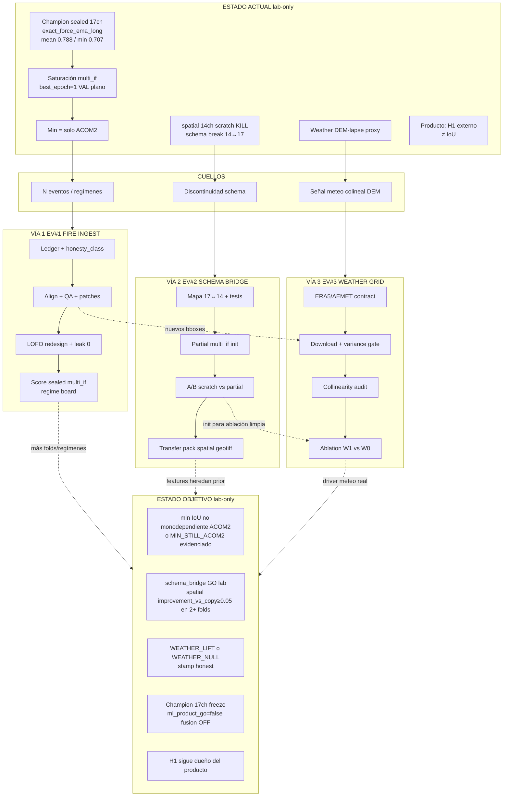

# WFD High-EV Engineering Graph — Fires · Schema Bridge · Weather

**Status:** `research_open` only · `ml_product_go=false` · fusion OFF · IoU ≠ ROS  
**Sealed champion (do not thrash):** `exact_force_ema_long` mean **0.787770** / min **0.707146** (`recipe_t1_fix`, residual-small, multi_if)  
**Product block:** H1 (demo + acta tercero) — **not** IoU  
**Date:** 2026-08-07

Rails (immutable): residual-small default · no larger U-Net as plan · no Tobarra KEEP thrash · no invented KEEP · no field ML fusion · honesty stamps on every work_class.

---

## 0. Estado actual (nodo raíz)

| Hecho medido | Implicación de ingeniería |
|--------------|---------------------------|
| `best_epoch=1` en folds sellados; VAL plano | Fine-tune LOFO **no** es el multiplicador |
| min IoU ≈ 0.707 = **solo ACOM2** | Diversificar regímenes de growth > hparams |
| EMA/force grids ≈ **+0.002** residual | Recipe thrash = ruido; freeze champion bar |
| spatial 14ch from-scratch → KILL ~0.39 | Sin prior multi_if no hay salto de features |
| DEM-lapse weather = proxy colineal con DEM | No vender como reanálisis |
| 6–7 IF útiles; ACOM2 masks << frames; Retuerta QA flag | N eventos es el cuello de botella de datos |

**Anti-patrones prohibidos en este graph:** grid lr/epochs, U-Net grande, reabrir Tobarra KEEP, flip `ml_product_go`, fusion ON.

---

# VÍA 1 — Ingest de fires nuevos (EV #1)

## A. Diagnóstico brutal

El min y el mean están **dominados por diversidad de regímenes**, no por capacidad del U-Net. ACOM2 es un singleton de growth; LOFO core-3 no puede “inventar” un cuarto régimen. Fine-tune multi_if ya saturado: más epochs no mueven VAL. Sin ≥2 fires nuevos **con cadenas temporales honestas** (LWIR/máscaras alineadas o perímetros multi-hora auditables), el techo ~0.79/0.707 es estructural.

Inventario real (`docs/DATA_INTAKE_STATUS.md`):

- Completos: Tobarra, Cardoso, ACOM1/2, Hellín, Brazatortas, Retuerta (parcial QA).
- Parcial: Polán (1 LWIR, 0 masks).
- Open/no-LWIR: CEMS, REDIAM, RAI, La Mierla (press ≠ EGIF).
- Anclas confirmed: Tobarra + Hellín only.

**Cuello:** pipeline de descubrimiento → derechos/ancla → align → máscaras → parches → **LOFO fold nuevo** con 0 leak. No el trainer.

## B. Loop de ingeniería (medible)

| # | Paso | Acción concreta | Artefacto / comando | Done del paso |
|---|------|-----------------|---------------------|---------------|
| 1.0 | Freeze baseline | No reentrenar recipe champion; stamp bar inmutable | `outputs/ml_eval/lab_loop/HISTORIC_CHAMPION_exact_force_ema_long.json` | bar leída por scorer |
| 1.1 | Candidate ledger | Lista de ≥8 candidatos (CLM, INFOCAM, GEACAM, open CCAA, CEMS) con: bbox, fechas, tipo de máscara, riesgo QA | `docs/DATA_INTAKE_CANDIDATES.md` + CSV | 8 filas con campos obligatorios |
| 1.2 | Triage honesty | Clasificar cada uno: `chain_honest` / `perimeter_only` / `press_only` / `blocked` | columna `honesty_class` | 0 press_only en cola ML |
| 1.3 | External unblock | Solicitudes ancla/EGIF/perímetro (CyL, GEACAM, AND) — paralelo a 1.4 | `docs/CONTACTOS_*` + log outreach | ≥1 solicitud enviada/semana o blocked documentado |
| 1.4 | Ingest raw | Materializar LWIR + masks o perímetros multi-hora | `batch_process_fires.py`, `materialize_lwir_masks.py`, ops_perimeter | fire_id en `artifacts/` con inventory JSON |
| 1.5 | Align + QA | Cadena alineada; área/FOV/Δt; flag Retuerta-class | `aligned_spatial_v1/<id>/` + QA report | `qa_grade ∈ {A,B}` o `QA_FLAG` + exclusión train |
| 1.6 | Emit patches | legacy17 **y/o** spatial_v1 re-emit (según schema path activo) | `reemit_*` / CLM pack builders | n_patches ≥ 40 y `source` stamp |
| 1.7 | LOFO redesign | Nuevo pack: core-3 **o** core-4+; **nunca** held en train | `build_clm_lofo_splits.py` / `build_lofo_mix_v1.py` + `audit_lofo_pack_leak.py` | leak audit **0** |
| 1.8 | Sealed score | Kaggle residual-small + multi_if init; scorer E2 | `kaggle_job/run_metrics_lift_*` + `score_metrics_lift_kill_criteria.py` | board + kill JSON |
| 1.9 | Regime board | Reportar IoU por held + **growth regime tags** (slow/fast/ACOM-like) | `outputs/ml_eval/lab_loop/regime_board_*.json` | ACOM2 deja de ser único min **o** min↑ documentado |

**Criterio de iteración:** si 1.8 no mueve min ≥ +0.005 vs champion **y** no hay fold nuevo en board → volver a 1.1/1.3 (datos), **no** a hparams.

## C. Riesgos honesty / leakage / comparabilidad

| Riesgo | Mitigación |
|--------|------------|
| Press ha / La Mierla como label | `honesty_class=press_only` → **nunca** train/test IoU product |
| Perímetro ops ≠ cadastre | stamp `perimeter_ops`; O2 nacional sigue blocked |
| Leak held→train en mix | `audit_lofo_pack_leak.py` gate CI-local antes de Kaggle |
| Comparar spatial board vs sealed T1 | work_class distinto; boards separados; no “batir T1” con features |
| ACOM2 masks << frames | no oversample test; documentar n_masks/n_frames |
| Retuerta QA | default exclude train hasta clean |

## D. Done (no inflado)

**V1-DONE** cuando se cumplen **todos**:

1. ≥ **2** fires nuevos con `honesty_class=chain_honest` (o `perimeter_only` multi-hora auditada) en train pool LOFO.  
2. Leak audit 0 en pack usado.  
3. Board LOFO residual-small multi_if con **≥1 held nuevo** o core-3 redesigned con N_train↑ medible.  
4. `lofo_min` **> 0.707146** **o** (si no) informe `MIN_STILL_ACOM2` con evidencia de que el nuevo fire **no** aporta régimen (no auto-KEEP inventado).  
5. `ml_product_go` sigue false; fusion OFF.

**No es done:** “encontramos PDFs” · “subimos mean 0.001 con EMA” · open scrape sin máscaras.

## E. Dependencias

- **Paralelo** con Vía 2 (diseño puente) y Vía 3 (descarga ERA5 offline).  
- **Bloquea** valor real de Vía 2/3 en métrica min: sin N fires, bridge/weather no mueven ACOM2.  
- **No depende** de H1 producto; sí alimenta demo si hay mapa nuevo (secundario).

---

# VÍA 2 — Puente schema 14↔17 + pretrain spatial (EV #2)

## A. Diagnóstico brutal

multi_if es un prior **17ch** (legacy17). spatial_v1 es **14ch** (physics14 names). U-Net `in_channels` se infiere del tensor; **no hay load parcial honesto** de `weights_multi_if.pt` en 14ch sin contrato de mapeo.

Resultado medido: spatial from-scratch ≈ copy en CARDOSO/ACOM1 (KILL 0.39). El salto de features está **bloqueado por discontinuidad de schema**, no por falta de geotiffs.

Opciones honestas (elegir **una** como path principal):

| Path | Idea | EV | Riesgo |
|------|------|-----|--------|
| **P2-A Projector** | legacy17 → physics14 slots + missing_mask; init conv1 parcial | alto, rápido | no inventar physics14 “lleno” |
| **P2-B Re-pretrain 14ch** | NDWS/CLM multi-fire en spatial_v1/physics14 hasta prior fuerte | alto, lento | coste Kaggle; no hereda multi_if bytes |
| **P2-C Dual-head** | backbone compartido + adapters 14/17 | medio | complejidad; aplazamiento |

**Default del graph: P2-A primero (1 sprint), P2-B en paralelo si P2-A no da Δ≥0.02 mean vs spatial scratch.**

## B. Loop de ingeniería (medible)

| # | Paso | Acción | Artefacto | Done del paso |
|---|------|--------|-----------|---------------|
| 2.0 | Channel map spec | Tabla 17→14: name, index, fill policy (`drop`/`gap`/`project`), never-channel list | `docs/SCHEMA_BRIDGE_14_17.md` + JSON schema | 17 filas mapeadas; tests unit |
| 2.1 | Projector code | `project_legacy17_to_spatial_v1(x, mask) → (14,H,W), missing_mask` | `wildfire_front/ml/schema_bridge.py` | tests: shape, no silent fill de wind/precip |
| 2.2 | Init adapter | Cargar multi_if; copiar pesos conv de canales mapeados; random/GAP en rest | `init_from_multi_if_partial(...)` | load sin crash; stamp `init=partial_multi_if` |
| 2.3 | Pack bridge | Dataset LOFO core-3 en **14ch proyectado** desde sealed lofo_v1 (misma geografía) | `artifacts/.../lofo_v1_projected_spatial14/` | fingerprint + manifest work_class=`schema_bridge_v1` |
| 2.4 | Control train | Kaggle residual-small: (i) scratch 14ch sealed-projected (ii) partial multi_if init | boards A/B | A y B en mismo pack |
| 2.5 | Gate | Δ mean / min vs (i); vs sealed 17ch champion **solo como referencia no-comparable** | kill + scorecard | B > A en mean **y** min; si no → pivot P2-B |
| 2.6 | Spatial transfer | Aplicar init parcial a pack `lofo_mix_spatial_estrella_v1` (DEM+fuel) | board spatial+bridge | mean spatial > 0.50 y > copy+0.05 en ≥2 folds |
| 2.7 | Freeze | Si gate ok: stamp `SCHEMA_BRIDGE_GO=lab_only`; **no** fusion | JSON stamp | rails intactos |

**P2-B (si pivot):** pretrain multi-fire 14ch en NDWS+CLM spatial re-emit (Kaggle), luego LOFO; work_class=`pretrain_spatial14_v1`; **no** reclamar “es multi_if”.

## C. Riesgos honesty / leakage / comparabilidad

| Riesgo | Mitigación |
|--------|------------|
| Vender projected 14ch como spatial geotiff | work_class `schema_bridge_projected` ≠ `feature_spatial_v1` |
| Constant fill de weather “para que cargue” | missing_mask + never-allowlist; refuse silent |
| Comparar IoU 14ch bridge vs 17ch champion como mismo T1 | boards duales; `comparability: not_same_schema` |
| Leak al reemit | mismos folds sealed; no mezclar test held |
| Partial init que deja capa muerta | log % pesos copiados; ablate freeze_encoder |

## D. Done (no inflado)

**V2-DONE** cuando:

1. Spec + tests del mapa 17↔14 en CI local.  
2. Board **B (partial init) > A (scratch)** en core-3 projected: `mean_B − mean_A ≥ 0.02` **y** `min_B ≥ min_A`.  
3. En pack spatial real (geotiff): al menos **2/3 folds** con `improvement_vs_copy ≥ 0.05`.  
4. Ningún stamp `ml_product_go=true`.  
5. Documentado qué canales **no** heredan prior (honest gap list).

**No es done:** “compiló el projector” · un solo fold ACOM2 lucky · igualar sealed 0.79 en spatial.

## E. Dependencias

- **Paralelo** con Vía 1 (1.1–1.5) y Vía 3 inventario.  
- **Se beneficia** de Vía 1 (más fires en pretrain 14ch).  
- **Vía 3** mejora input de 2.6 pero **no bloquea** 2.0–2.5 (projected sealed no necesita ERA5).  
- **No** descongela recipe champion 17ch salvo experimento etiquetado `recipe_t1_*` aparte.

---

# VÍA 3 — Weather gridded fuerte (EV #3)

## A. Diagnóstico brutal

DEM-lapse: tmin/tmax ≈ f(elevation); wind/precip a menudo near-constant en parches. Señal **colineal con terrain** → el U-Net ya “ve” el DEM. No es fallo de train; es **falta de driver meteorológico real** (viento/RH espacial no trivial).

Sin Vía 2, meter ERA5 en 14ch from-scratch **no** hereda multi_if → riesgo de otro KILL caro. Orden correcto: **fuente fuerte + stamp honesty**, consumir en bridge/spatial **después** de partial init.

## B. Loop de ingeniería (medible)

| # | Paso | Acción | Artefacto | Done del paso |
|---|------|--------|-----------|---------------|
| 3.0 | Source pick | Elegir **una** fuente primaria: ERA5-Land hourly (CDS) **o** AEMET raster si disponible; documentar licencia | `docs/WEATHER_GRIDDED_SOURCE.md` | 1 fuente + API/cuenta OK |
| 3.1 | Variable contract | Variables: `u10,v10`→speed/dir, `t2m`, `d2m`→RH, `tp`; resolución, time snap (nearest hour a LWIR) | contract JSON | sin scalar inventado |
| 3.2 | Download offline | Por fire bbox+date window; cache `data/weather_era5/<key>/` | tifs o netcdf→tif | 7 core fires con full core keys |
| 3.3 | Variance gate | Por raster: `std` spatial; fail si wind_speed y humidity ambos constant | inventory script | `weather_full_core=true` y `constant_keys=[]` en wind/RH **o** blocked |
| 3.4 | Collinearity audit | Correlación wind/RH vs elevation; report R² | `outputs/ml_eval/weather_collinearity.json` | wind R² vs elev **< 0.5** (o stamp “still weak”) |
| 3.5 | Re-emit | spatial_v1 full reemit con weather_dir ERA5 (no DEM-lapse default) | report gaps=[] weather_is_spatial | n_patches estable |
| 3.6 | Ablation board | Mismo pack geometry: (W0 DEM-lapse) vs (W1 ERA5) con **mismo init** (bridge si V2 listo; si no scratch stamp) | two kill JSONs | W1 mean ≥ W0 + 0.01 **o** honest null result |
| 3.7 | Freeze source | Default weather path = ERA5 si 3.6 pass; else keep DEM-lapse + stamp | config | no silent fallback |

## C. Riesgos honesty / leakage / comparabilidad

| Riesgo | Mitigación |
|--------|------------|
| Future weather / wrong hour | snap a timestamp LWIR; document timezone |
| Train/test same ERA5 field OK | no leak; leakage es **fuego held en train**, no clima |
| Vender ERA5 como AEMET estación | provenance stamp `era5_land` |
| Ablation con hparams distintos | fixed seed, same epochs schedule as spatial baseline |
| Null result oculto | publicar W1 ≤ W0 como `WEATHER_NULL` |

## D. Done (no inflado)

**V3-DONE** cuando:

1. ≥ core fires con ERA5 (o fuente elegida) **wind + humidity spatial non-constant**.  
2. Collinearity audit escrito.  
3. Ablation W1 vs W0 en board comparable (mismo schema/init).  
4. O bien `WEATHER_LIFT` (Δmean≥0.01) o `WEATHER_NULL` documentado — **ambas son done de investigación**.  
5. DEM-lapse no se borra: queda como fallback honesty path.

**No es done:** “descargamos un nc global” · DEM-lapse renombrado · lift solo en un fold sin board.

## E. Dependencias

- **Paralelo:** 3.0–3.4 con Vía 1 y 2.0–2.5.  
- **Consumo métrico fuerte:** tras V2-DONE (init) o con scratch explícito.  
- **No bloquea** H1 producto.

---

# Dependencias entre vías (matriz)

| | V1 Fires | V2 Bridge | V3 Weather |
|--|----------|-----------|------------|
| **V1** | — | V2 se beneficia de más fires en pretrain | V3 se aplica a más bboxes |
| **V2** | no bloquea V1 | — | desbloquea medición limpia de V3 |
| **V3** | no bloquea V1 | no bloquea diseño V2 | — |

**Paralelo máximo seguro:** V1.1–1.5 ‖ V2.0–2.5 ‖ V3.0–3.4  
**Secuencial de valor:** V1.6–1.9 y V2.6–2.7 antes de celebrar V3.6  
**Serial prohibido:** recipe hparam grid como “V4”

---

# Diagrama del graph



### Versión texto (si Mermaid no renderiza)

```
[NOW] champion 17ch 0.788/0.707 | best_ep=1 | min=ACOM2 | spatial scratch KILL | DEM-lapse | H1 blocks product
        |                    |                    |
        v                    v                    v
   (B1 N fires)         (B2 14↔17)          (B3 meteo weak)
        |                    |                    |
        v                    v                    v
   V1 ingest loop       V2 bridge+partial     V3 ERA5 loop
   ledger→QA→LOFO       map→init→A/B→spatial  source→var→ablate
        |                    |                    |
        +--------------------+----------+---------+
                             v
[TARGET lab] multi-regime min | bridge GO | weather LIFT|NULL | freeze champion | fusion OFF | H1 still product gate
```

---

# Priorización semanal recomendada

| Semana | Foco primario (60–70%) | Paralelo (30–40%) | Por qué | Exit de semana |
|--------|------------------------|-------------------|---------|----------------|
| **S1** | V1.1–1.5 ledger + 1er fire en align/QA | V2.0–2.1 spec+tests mapa 17↔14; V3.0–3.1 fuente+contract | Multiplicador N; bridge diseño barato; weather no bloquea | ≥1 fire nuevo `chain_honest` en artifacts; schema doc merged |
| **S2** | V1.6–1.8 pack LOFO + Kaggle sealed score | V2.2–2.5 projector+A/B partial init | Medir si datos mueven min; bridge prueba en sealed projected | leak 0; board V1; board A/B V2 |
| **S3** | V2.6 transfer spatial + init | V3.2–3.5 download ERA5 core fires + reemit | Features solo tras partial init; weather listo para ablación | spatial 2+ folds beat copy+0.05 **o** pivot P2-B kickoff |
| **S4** | V3.6 ablation W1 vs W0 + V1.9 regime board | V1 más fires si min sigue ACOM2 | Cerrar weather con comparabilidad; datos si hace falta | `WEATHER_LIFT` o `WEATHER_NULL`; informe mesa |
| **S5+** | Solo si V1 min no sube: más ingest / open IF packs | P2-B pretrain 14ch multi-fire | No volver a hparam thrash | nuevo champion **o** techo documentado |

**Regla de matanza semanal:** si un sprint solo mueve mean < 0.005 sin fire nuevo ni bridge gate → **stop** y reasignar a V1.1/1.3.

---

# Frase de control (mesa)

> **Estrategia lab:** congelar el champion multi_if (el IoU ya no se compra con hparams); multiplicar incendios y regímenes (ACOM2 deja de ser el único min); puentear 14↔17 para que las features espaciales hereden el prior; y solo entonces medir weather gridded de verdad — todo en research_open, fusion OFF; el producto sigue bloqueado por H1, no por la tercera cifra del IoU.

---

## Checklist agente (ejecución corta)

```text
[ ] V1 candidate ledger ≥8
[ ] V1 ≥1 fire chain_honest materializado
[ ] V1 leak audit 0 + sealed board
[ ] V2 SCHEMA_BRIDGE_14_17.md + tests
[ ] V2 A/B partial init Δmean≥0.02
[ ] V2 spatial 2 folds improvement_vs_copy≥0.05
[ ] V3 ERA5 core + collinearity
[ ] V3 ablation W1 vs W0 published
[ ] rails: ml_product_go false, fusion OFF, no Tobarra KEEP reopen
[ ] no hparam grid as primary work
```

## Referencias repo

- Champion: `outputs/ml_eval/lab_loop/HISTORIC_CHAMPION_exact_force_ema_long.json`
- Intake: `docs/DATA_INTAKE_STATUS.md`, `data/infocam_anchors.json`
- Schema: `wildfire_front/ml/feature_schema.py` (`legacy17` / `spatial_v1`)
- Spatial ops: `scripts/run_spatial_v1_full_reemit.py`, `scripts/run_kaggle_spatial_v1_estrella.py`
- Mix LOFO: `scripts/build_lofo_mix_v1.py`
- Weather proxy: `scripts/stage_dem_lapse_weather.py`
- Scorer: `scripts/score_metrics_lift_kill_criteria.py`
